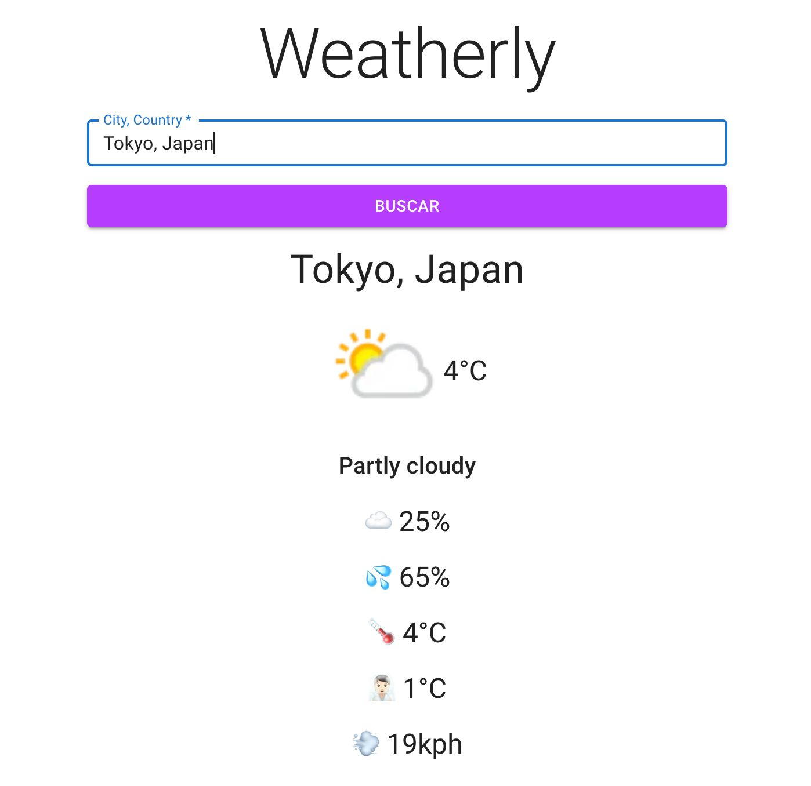

# Weatherly App

Weatherly is a weather forecasting application built with React and JavaScript. It utilizes Material UI for its design components and is bundled using Vite. The app fetches weather data from the WeatherAPI and is deployed on Vercel.

## Features

- **Weather Forecast**: Get accurate weather forecasts for various locations.
- **Material UI Design**: Intuitive and sleek user interface designed using Material UI components.
- **Fast Performance**: Optimized performance with Vite bundling for quick loading times.
- **API Integration**: Utilizes WeatherAPI for fetching real-time weather data.
- **Responsive**: Works seamlessly across different devices and screen sizes.

## Technologies Used

- **React**: JavaScript library for building user interfaces.
- **JavaScript**: Programming language for building dynamic web applications.
- **Material UI**: React component library for designing UI elements.
- **Vite**: Fast, opinionated web dev build tool that serves your code via native ES Modules.
- **WeatherAPI**: External API for retrieving weather data.
- **Vercel**: Platform for deploying web applications.

## Getting Started

To run Weatherly locally, follow these steps:

1. Clone the repository from GitHub.
2. Navigate to the project directory.
3. Install dependencies using `npm install`.
4. Start the development server with `npm run dev`.
5. Open the application in your browser at `http://localhost:5173`.

## Usage

Once the app is running, you can:

- Search for a location to get its current weather forecast.
- View detailed weather information including temperature, humidity, wind speed, etc.
- Explore forecasts for upcoming days.
- Enjoy a seamless and visually pleasing user experience.

## Deployment

Weatherly is deployed on Vercel. Any changes pushed to the main branch of the GitHub repository trigger automatic deployment through Vercel's continuous integration and deployment pipeline.

You can access the deployed version of Weatherly [here](https://weatherly-jade.vercel.app/).

## Contributing

Contributions to Weatherly are welcome! Feel free to fork the repository, make changes, and submit pull requests for review.

## License

This project is licensed under the [MIT License](https://opensource.org/licenses/MIT).
